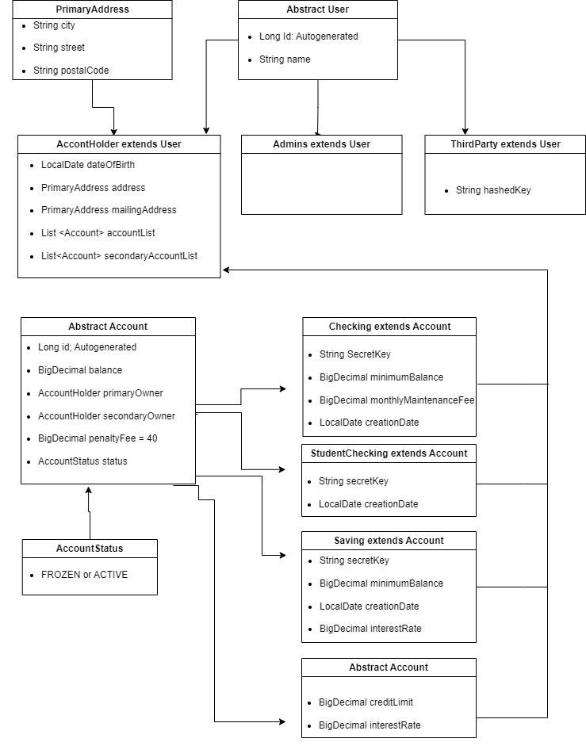
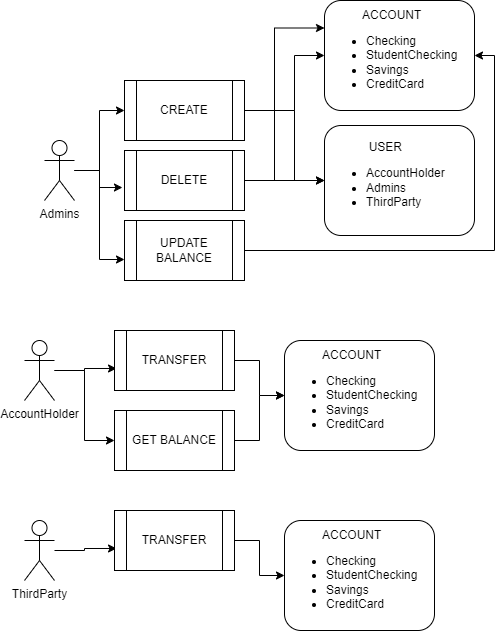

# Bank App

### This app is for easy transfers between AccountHolders and ThirdParties.

### The Admins of the app can create three types of Accounts:

- Checking accounts.
- StundetCheking accounts.
- Savings.
- CreditCards.

##### Savings
Have a default interest rate of 0.0025
May be instantiated with an interest rate other than the default, with a maximum interest rate of 0.5
Should have a default minimumBalance of 1000
May be instantiated with a minimum balance of less than 1000 but no lower than 100

##### CreditCards
Have a default creditLimit of 100
May be instantiated with a creditLimit higher than 100 but not higher than 100000
Have a default interestRate of 0.2
May be instantiated with an interestRate less than 0.2 but not lower than 0.1

##### CheckingAccounts
If the primaryOwner is less than 24, a StudentChecking account should be created otherwise a regular Checking Account should be created.
Should have a minimumBalance of 250 and a monthlyMaintenanceFee of 12
Interest and Fees should be applied appropriately.

##### PenaltyFee
For all accounts should be 40.
If any account drops below the minimumBalance, the penaltyFee should be deducted from the balance automatically

##### InterestRate
On savings accounts is added to the account annually at the rate of specified interestRate per year.
That means that if I have 1000000 in a savings account with a 0.01 interest rate, 1% of 1 Million is added to my account after 1 year.
When a savings account balance is accessed, you must determine if it has been 1 year or more since either the account was created or since interest was added to the account, and add the appropriate interest to the balance if necessary.
On credit cards is added to the balance monthly. If you have a 12% interest rate (0.12) then 1% interest will be added to the account monthly.
When the balance of a credit card is accessed, check to determine if it has been 1 month or more since the account was created or since interest was added, and if so, add the appropriate interest to the balance.

### Flow Chart

### Use case

